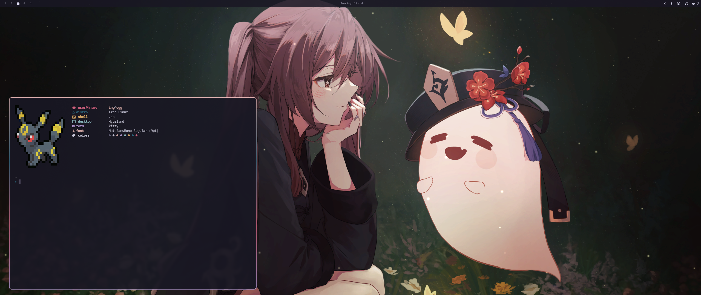

# Some dots here and there

Hyprland setup heavily based on [HyDE](https://github.com/HyDE-Project/HyDE) and [Omarchy](https://github.com/basecamp/omarchy).



## Dependencies

### Projects
- Bootloader: [Catppuccin Grub](https://github.com/catppuccin/grub)
- Greeter: [Catppuccin SDDM](https://github.com/catppuccin/sddm)
- Browser themes:
  - Firefox: [Catppuccin Firefox](https://github.com/catppuccin/firefox), [Rose Pine Firefox](https://github.com/rose-pine/firefox)
  - Zen Browser: [Catppuccin Zen](https://github.com/catppuccin/zen-browser), [Rose Pine Zen](https://github.com/rose-pine/zen-browser)
- Spotify: [Catppuccin Spotify](https://github.com/catppuccin/spicetify), [Rose Pine Spotify](https://github.com/rose-pine/spicetify)

### Packages
See `packages.lst` and `flatpak.lst`.

Key packages this project depends on:
| Category | Packages |
|----------|----------|
| Display compositor | `hyprland`, `hyprlock`, `hypridle`, `hyprshot` |
| Display manager | `sddm`, `qt6-wayland` |
| Bar/notifications | `waybar`, `mako`, `swayosd` |
| Launchers | `rofi`, `wlogout` |
| Shell | `zsh`, `starship`, `fzf`, `fd` |
| Terminal | `kitty` |
| GPU | `nvidia-dkms` (or `nvidia`), `nvidia-utils` |
| Theming | `spicetify-cli`, `spicetify-themes`, `gnome-themes-extra` |

### System Requirements

#### NVIDIA
This setup targets **NVIDIA GPUs**. The following are required for proper operation:

**Kernel parameters** (`/etc/default/grub`):
```
nvidia_drm.modeset=1 nvidia_drm.fbdev=1
```

**Environment variables** (set in Hyprland config):
```
GBM_BACKEND=nvidia-drm
__GLX_VENDOR_LIBRARY_NAME=nvidia-drm
```

**SDDM display config** (`/etc/X11/xorg.conf.d/10-sddm-monitor.conf`):
NVIDIA MetaModes to select the primary display at the login screen. See [etc/X11/xorg.conf.d/10-sddm-monitor.conf](etc/X11/xorg.conf.d/10-sddm-monitor.conf).

**Polkit rules** (`/etc/polkit-1/rules.d/50-restart-sddm.rules`):
Allows passwordless SDDM restart for applying display changes.

#### Other
- **XCompose**: Dead key compose mappings (see [XCompose](XCompose))
- **Flatpak**: Desktop entry symlinks for Flatpak apps in `~/.local/share/applications/`
- **Font handling**: Uses `fontconfig` + Nerd fonts; see Font System below

## Install

```sh
git clone git@github.com:innng/dotfiles.git ~/.dots
~/.dots/bin/dots-install
```

Reboot or log out after install, then apply a theme and font:

```sh
dots-theme-set <catppuccin|rose-pine> 
```

## Theme System

Themes live in `themes/<name>/` and define colors in `colors.toml`. Template files in `themes/templates/*.tpl` use `{{ variable }}`, `{{ variable_strip }}`, and `{{ variable_rgb }}` placeholders that get substituted from `colors.toml`.

Each theme can also provide static app-specific config files (like `kitty.conf`, `mako.ini`, `hyprland.conf`) that override template-generated versions.

### Themed Applications

| App | Template / Static | Reload Signal |
|-----|-------------------|---------------|
| Hyprland | Template + static | `hyprctl reload` |
| Hyprlock | Template + static | - |
| Kitty | Template + static | `SIGUSR1` |
| Waybar | Template | `SIGUSR2` |
| Mako | Template + static | `SIGHUP` |
| SwayOSD | Template + static | `SIGUSR1` |
| btop | Template + static | `SIGUSR2` (symlink) |
| GTK4 | Template | symlink |
| Rofi | Template | - |
| Starship | Template | env `STARSHIP_CONFIG` |
| Wlogout | Template | copy to `~/.config/wlogout/` |
| Obsidian | Template | - |
| OpenCode | Template | - |
| Spicetify | Static | `spicetify apply` |
| Firefox | Open URL (Firefox Color) | Confirm in app |
| Zen Browser | Static | Restart Browser |
| Telegram | Open URL | Confirm in app |

### Manual Theme Setup (not templated)

Some applications require manual one-time setup:

#### Discord (Vencord)
Theme CSS is stored in `themes/<name>/discord.css` and auto-symlinked to `~/.config/Vencord/themes/` by `dots-theme-set`.

#### Spotify (Spicetify)
Color schemes are stored in `themes/<name>/spotify.ini` and auto-configured by `dots-theme-set`. Requires `spicetify-cli` and `spicetify-themes` packages. Run `spicetify apply` manually after the first theme set or Spotify update.

## Font System

`dots-font-set <font-name>` changes the monospace font across all configured apps:
- Kitty, Waybar, Hyprland, Rofi, SwayOSD, Fontconfig

`dots-font-list` shows available monospace fonts.
